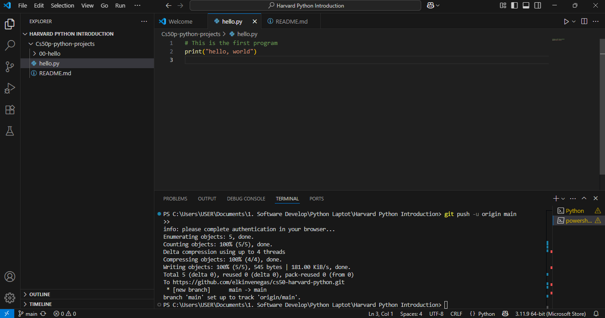

# 💻 CS50 Python Project – Hello, World!

This simple Python script demonstrates basic syntax and output using the `print()` function. It serves as the foundational step for understanding text output in Python.

---

## 📸 Screenshot



---

## 🛠️ Technologies

- Python 3.11.9
- Visual Studio Code
- Git & GitHub

---

## ▶️ How to run

To run the program, use the following command in your terminal:

```bash
python 00-hello/hello.py
```

## 📚 What I learned
- How to create and run a Python script.
- How to use the `print()` function.
- Basic Git workflow: commit and push.